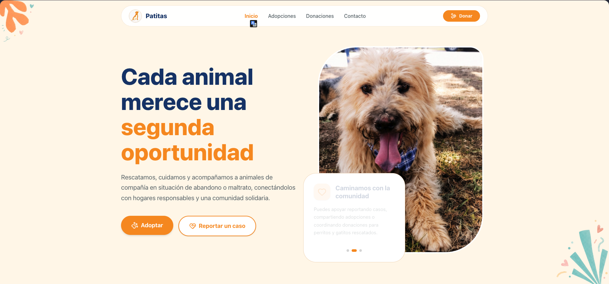

# Patitas Caminando - Landing Page 🐾

Bienvenido al repositorio oficial de la Landing Page de **Patitas Caminando**, una organización dedicada a rescatar, cuidar, rehabilitar y buscar hogares responsables para animales de compañía que han sido olvidados, abandonados o maltratados.



## Descripción del Proyecto

Esta es la primera fase del sitio web oficial (Landing Page), cuyo objetivo es centralizar la información de la organización, permitir a la comunidad conocer a los animales rescatados, facilitar procesos de adopción, recolectar donaciones y habilitar reportes de casos de emergencia.

El proyecto está desarrollado con tecnologías modernas orientadas al rendimiento y accesibilidad.

## Tecnologías Utilizadas

- **Framework:** [Next.js](https://nextjs.org/) (App Router)
- **Lenguaje:** [TypeScript](https://www.typescriptlang.org/)
- **Estilos:** [Tailwind CSS](https://tailwindcss.com/)
- **Iconografía:** [Lucide React](https://lucide.dev/) & [React Icons](https://react-icons.github.io/react-icons/)
- **Animaciones:** [Lottie React](https://lottiefiles.com/)

## Estructura Principal

- `src/app`: Rutas principales de la aplicación.
- `src/components`: Componentes reutilizables agrupados bajo principios de diseño atómico (`atoms`, `molecules`, `organisms`, `sections`, `layout`, `ui`).
- `src/assets`: Recursos estáticos (imágenes, logos, doodles, lotties).

## Instalación y Ejecución Local

1. Clona el repositorio:
   ```bash
   git clone git@github.com:PatitasCaminando/patitascaminando_landing_page.git
   ```

2. Instala las dependencias:
   ```bash
   npm install
   ```

3. Levanta el servidor de desarrollo:
   ```bash
   npm run dev
   ```

4. Abre [http://localhost:3000](http://localhost:3000) en tu navegador para ver el resultado.

---
*Este documento se actualizará conforme avance la integración con el backend y las nuevas funcionalidades.*
